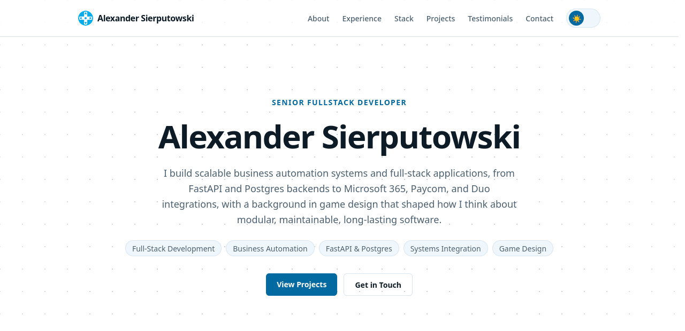
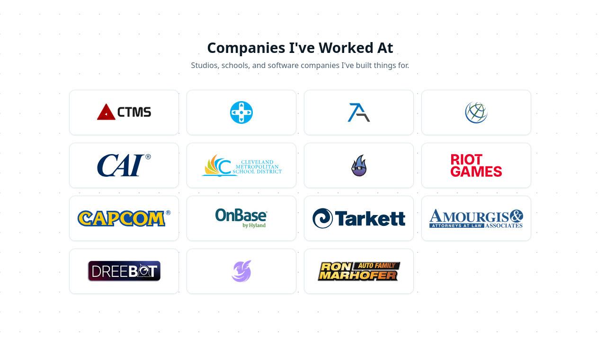
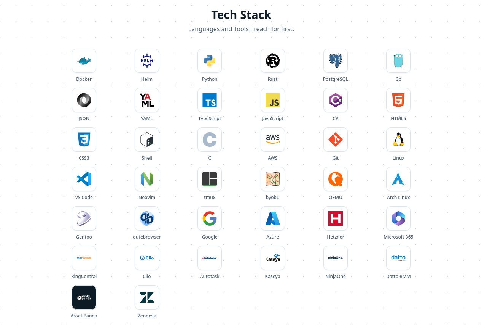
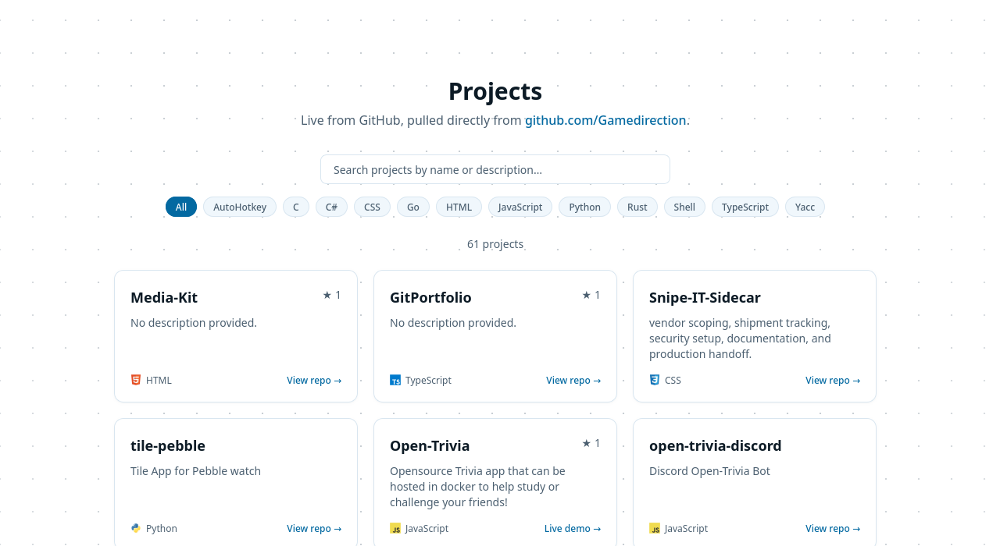
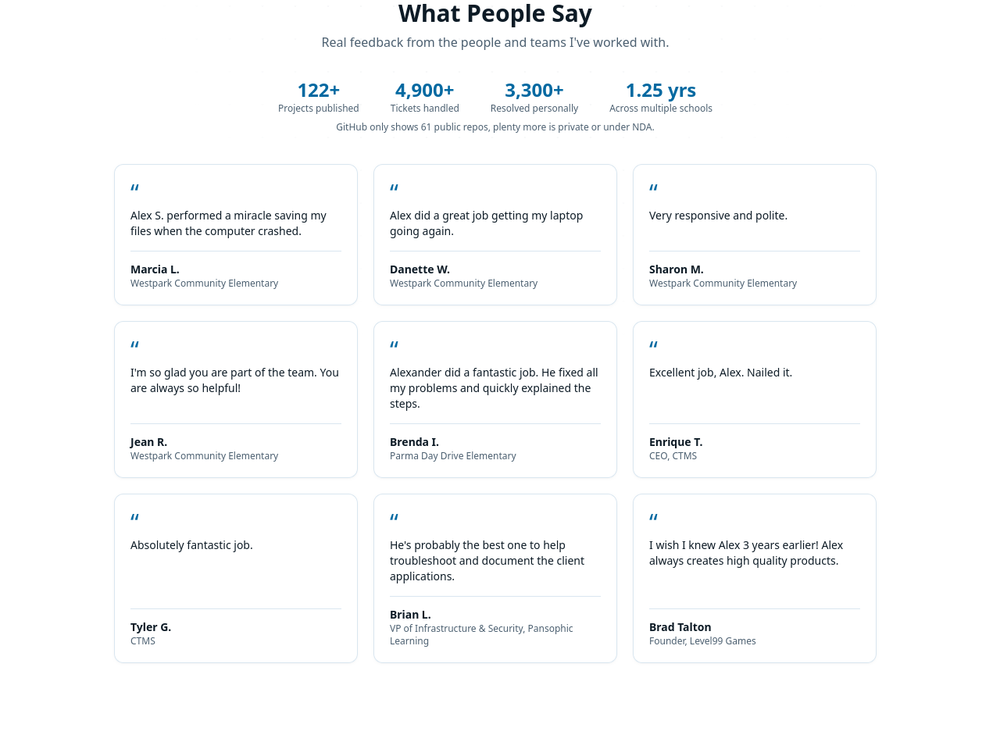
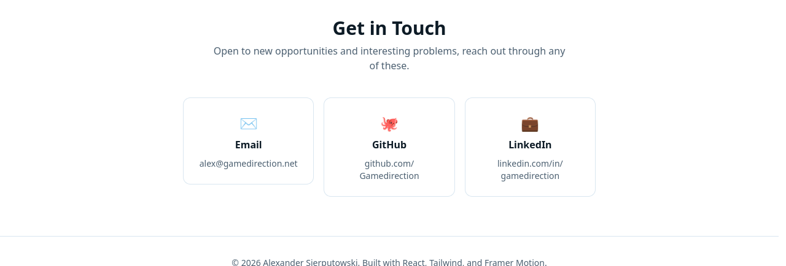

<p align="center">
  
</p>

<h1 align="center">Alexander Sierputowski</h1>
<p align="center"><strong>Senior Fullstack Developer</strong> - Business automation, full-stack applications, and systems integration.</p>

<p align="center">
  <a href="https://gamedirection.github.io/GitPortfolio/">Live Site</a> &middot;
  <a href="mailto:alex@gamedirection.net">Email</a> &middot;
  <a href="https://github.com/Gamedirection">GitHub</a> &middot;
  <a href="https://www.linkedin.com/in/gamedirection/">LinkedIn</a>
</p>

<p align="center">
  
</p>

I build scalable business automation systems and full-stack applications, from FastAPI and Postgres backends to Microsoft 365, Paycom, and Duo integrations, with a background in game design that shaped how I think about modular, maintainable, long-lasting software.

**Core skills:** Full-Stack Development &middot; Business Automation &middot; FastAPI & Postgres &middot; Systems Integration &middot; Game Design

## Companies I've Worked At

Studios, schools, and software companies I've built things for: CTMS, GameDirection, Accel Schools, Pansophic Learning, CAI, Cleveland Metropolitan School District, Riot Games, Capcom, Hyland (OnBase), Tarkett, Amourgis & Associates, DreeBot, Violet Knight, Ron Marhofer Auto Family.

<p align="center">
  
</p>

## Tech Stack

Languages and tools reached for first - Python, TypeScript, Rust, Go, C#, JavaScript, Docker, Postgres, AWS, Azure, and more.

<p align="center">
  
</p>

## Projects

Pulled live from [github.com/Gamedirection](https://github.com/Gamedirection) with search and language filters.

<p align="center">
  
</p>

## Testimonials

Real feedback from people and teams I've worked with.

<p align="center">
  
</p>

## Get in Touch

<p align="center">
  
</p>

| | |
|---|---|
| Email | [alex@gamedirection.net](mailto:alex@gamedirection.net) |
| GitHub | [github.com/Gamedirection](https://github.com/Gamedirection) |
| LinkedIn | [linkedin.com/in/gamedirection](https://www.linkedin.com/in/gamedirection/) |

---

## Development

Built with React 19, TypeScript, Vite, Tailwind CSS, and Framer Motion. Deployed to GitHub Pages via GitHub Actions on every push to `main`.

```bash
npm install
npm run dev       # local dev server
npm run build     # production build (tsc -b && vite build)
npm run lint      # oxlint
npm run preview   # preview the production build
```

### React + TypeScript + Vite Template Notes

This project started from the React + Vite template. Currently, two official plugins are available:

- [@vitejs/plugin-react](https://github.com/vitejs/vite-plugin-react/blob/main/packages/plugin-react) uses [Oxc](https://oxc.rs)
- [@vitejs/plugin-react-swc](https://github.com/vitejs/vite-plugin-react/blob/main/packages/plugin-react-swc) uses [SWC](https://swc.rs/)

#### React Compiler

The React Compiler is not enabled on this template because of its impact on dev & build performances. To add it, see [this documentation](https://react.dev/learn/react-compiler/installation).

#### Expanding the Oxlint configuration

If you are developing a production application, we recommend enabling type-aware lint rules by installing `oxlint-tsgolint` and editing `.oxlintrc.json`:

```json
{
  "$schema": "./node_modules/oxlint/configuration_schema.json",
  "plugins": ["react", "typescript", "oxc"],
  "options": {
    "typeAware": true
  },
  "rules": {
    "react/rules-of-hooks": "error",
    "react/only-export-components": ["warn", { "allowConstantExport": true }]
  }
}
```

See the [Oxlint rules documentation](https://oxc.rs/docs/guide/usage/linter/rules) for the full list of rules and categories.
